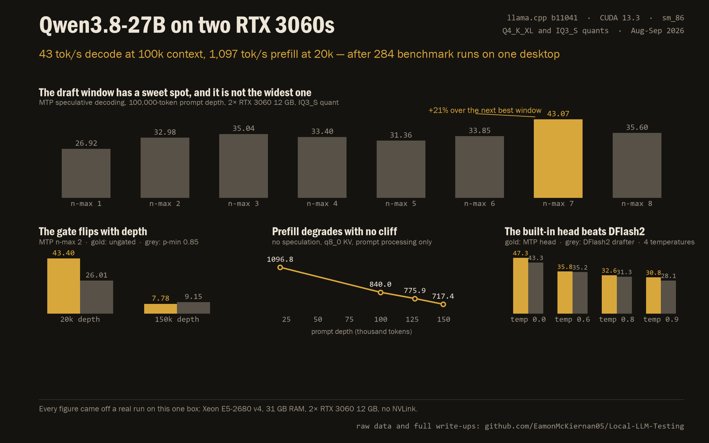

# Local-LLM-Testing
All configurations and tests done on my local ai server

## Current Hardware Setup
CPU: Xeon E5 2680 V4
RAM: 32GB DDR4 2400mhz (31 GB visible to the OS)
GPUs: 3x RTX 3060 12GB — only 2 enumerated since 2026-09-23, when the third card (PCIe 2.0 x4 slot) stopped appearing on the bus
Motherboard: MACHINIST X99-MR9A PRO MAX — single socket, no NVLink; GPU0/GPU1 on PCIe 3.0 x16

## Planned Upgrades:
+32GB DDR4 2400mhz - already purchased
+1 RTX 3060 12GB - already purchased
Dual Xeon Motherboard - waiting on refund from AliExpress
2x Xeon E5 2650 V4 - already purchased

## Current Daily-Driver Software Stack
OS: Ubuntu 24.04
Cuda: 13.3
Inference Engine: Llama.cpp (Mainline) — build `b11041` (`4fea119de`), sm_86-only CUDA build
Serving: `llama-server.service` on `:8080`
Harness: Hermes Agent (on main Windows workstation in WSL)

---

## Tests

### Qwen3.8-27B on llama.cpp — 284 measured runs

Everything we have on this model, in one place: **[`qwen3.8-27b-llama-cpp/`](qwen3.8-27b-llama-cpp/)**

Two GGUF quants (`Q4_K_XL` and `IQ3_S + MTP`), two and three RTX 3060s, 2026-08-14 to 2026-09-23. Every figure came off a real run on the box in the section above — no vendor numbers, no extrapolation.

**The findings:**

| | |
|---|---|
| Fastest decode at 100k prompt depth | **43.07 tok/s** — MTP `--spec-draft-n-max 7`, ungated, two cards, tensor split `1,1` |
| Fastest decode at 20k depth | **44.33 tok/s** — MTP `n-max 2`, ungated |
| Fastest decode at 150k depth | **9.15 tok/s** — MTP `n-max 2`, gated `p-min 0.85` |
| Best prefill, 20k | **1,096.8 tok/s** (no speculation) |
| Best prefill, 150k | **717.4 tok/s** (no speculation) |
| Best prefill, three cards | **599 tok/s** (layer split) |
| Drafter verdict | The built-in MTP head beats every DFlash2 configuration at every temperature tested |
| Runs recorded | 284 — 277 measured, 7 died at load |

**What the sweeps cost people time not to re-learn:**

- The draft window peaks at `n-max 7` at 100k depth and `n-max 2` at 20k. Wider is not better.
- The `--spec-draft-p-min` gate is a 1.72x win at 20k and a 15% loss at 150k. The optimum inverts with depth, because at depth the round is no longer flat-cost.
- **Do not pass a single sampler flag unless you pass them all.** An unset sampler parameter is read from the GGUF's own metadata, so `--top-k 40` does not restate a default — it costs 35%.
- On two cards you choose tensor split + MTP or layer split + DFlash2, never both: DFlash2 aborts at load under row split.
- On three cards the extra card buys prefill and costs decode. The `-ts` balance moves prefill only.
- `-ub 256` is the prefill sweet spot at every `-b`.

**What's in the folder:** seven experiment write-ups in the order they were run, plus a separate pass over the `buun-llama-cpp` fork; every table as a CSV; the raw per-arm JSONL records we still hold; the harnesses and drivers; and the chart above with the script that draws it.

**Honest limits:** the raw per-arm files for two of the experiments (the 107-run DFlash2 bake-off and the 70-arm two-card sweep) stayed on the box and could not be copied — those tables are transcribed from the reports written from them on the day. Full detail in [`PROVENANCE.md`](qwen3.8-27b-llama-cpp/PROVENANCE.md).
