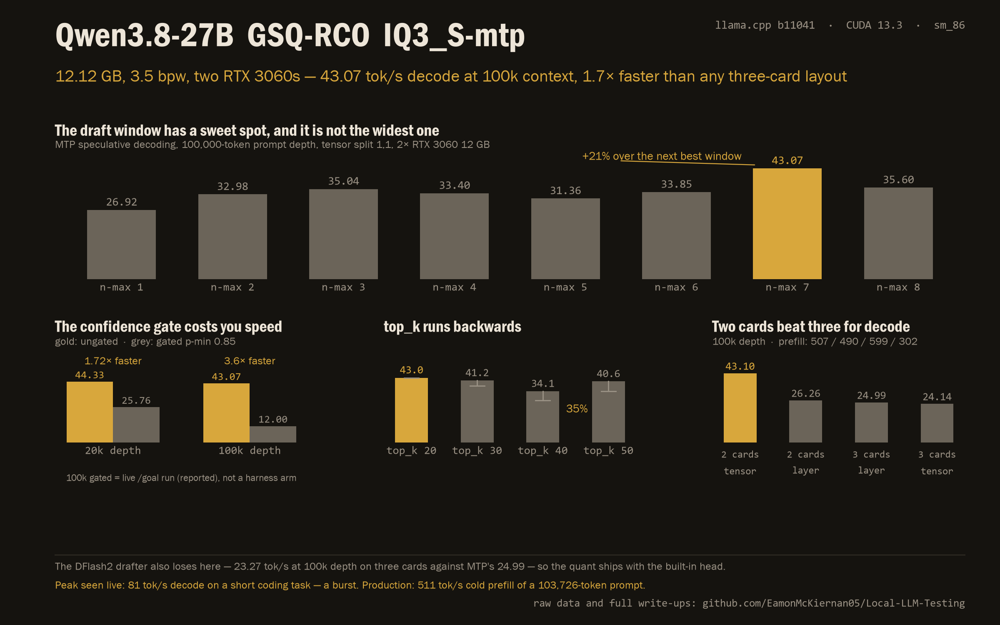
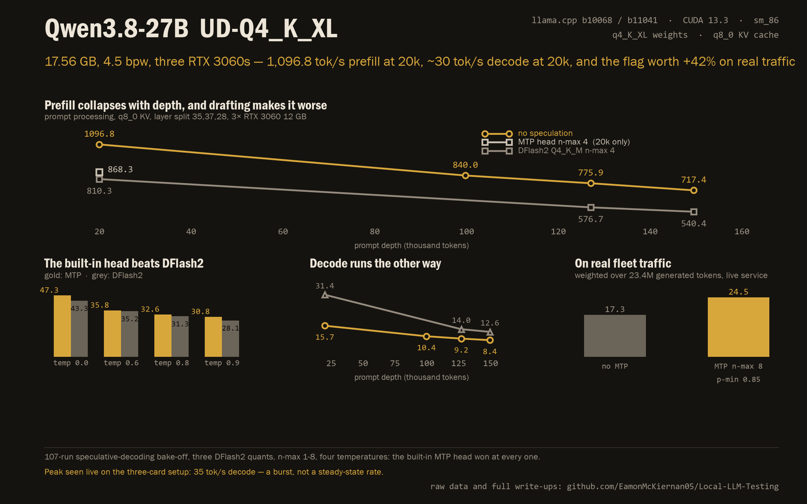

# Local-LLM-Testing
All configurations and tests done on my local ai server

## Current Hardware Setup

CPU: Xeon E5 2680 V4

RAM: 32GB DDR4 2400mhz 

GPUs: 2x Tesla V100 32GB (installed 2026-09-30)

Motherboard: MACHINIST X99-MR9A PRO MAX — single socket, no NVLink; 2x PCIe 3.0 x16 + 1x PCIe 2.0 x4 (Electrically x16)

## Planned Upgrades:

+32GB DDR4 2400mhz - already purchased

Dual Xeon Motherboard - want to see how far i can push 32GB before ordering

2x Xeon E5 2650 V4 - stored from previous builds/projects

## Current Daily-Driver Software Stack

OS: Ubuntu 24.04

Cuda: 12.9

Inference Engine: Project Maya v1.0.9 — GLM-5.3-Flash Maya-S on 2x V100, serving on `:8080`

Harness: Hermes Agent (on main Windows workstation in WSL)

---

## Tests

### Qwen3.8-27B on llama.cpp — 284 recorded runs, 277 with measurements

Everything we have on this model, in one place: **[`qwen3.8-27b-llama-cpp/`](qwen3.8-27b-llama-cpp/)**

Two GGUF quants (`Q4_K_XL` and `IQ3_S + MTP`), two and three RTX 3060s, 2026-08-14 to 2026-09-23. Every figure came off a real run on the box in the section above — no vendor numbers, no extrapolation.

One chart per quant, so nothing is mixed up. The smaller IQ3_S file on two cards is the one serving today:

The larger UD-Q4_K_XL file on three cards, where the DFlash2 bake-off was run:

**The findings:**

| | |
|---|---|
| Fastest decode at 100k prompt depth | **43.07 tok/s** — MTP `--spec-draft-n-max 7`, ungated, two cards, tensor split `1,1` |
| Fastest decode at 20k depth | **44.33 tok/s** — MTP `n-max 2`, ungated |
| Fastest decode at 150k depth | **9.15 tok/s** — MTP `n-max 2`, gated `p-min 0.85` |
| Best prefill, 20k | **1,096.8 tok/s** (no speculation) |
| Best prefill, 150k | **717.4 tok/s** (no speculation) |
| Best prefill, three cards | **599 tok/s** (layer split) |
| Drafter verdict | The built-in MTP head beats every DFlash2 configuration at every temperature tested |
| Runs recorded | 284 — 277 measured, 7 died at load |
| Peak seen live, two cards | **81 tok/s** decode on a short coding task (shallow context) — a burst, not a sweep figure |
| Best three-card decode, 100k | 24.96 tok/s — and 2-card tensor split did 43.06 on the same depth |

**The sampler flags (full detail: [`SAMPLERS.md`](qwen3.8-27b-llama-cpp/SAMPLERS.md)):** an unset flag is read from the model's own metadata, not from llama.cpp's defaults, so a bare command line is not the documented default. `--top-k 20` (the model's value) decodes 43 tok/s at 100k depth; `--top-k 40`, the value `--help` calls the default, costs 35%. `--min-p` does nothing once `top_k` is 20. `--spec-draft-p-min` is a 1.72x penalty at 20k depth and an 18% win at 150k, and the fast-looking acceptance number belongs to the *slower* arm.

**What the sweeps cost people time not to re-learn:**

- The draft window peaks at `n-max 7` at 100k depth and `n-max 2` at 20k. Wider is not better.
- The `--spec-draft-p-min` gate is a 1.72x win at 20k and a 15% loss at 150k. The optimum inverts with depth, because at depth the round is no longer flat-cost.
- **Do not pass a single sampler flag unless you pass them all.** An unset sampler parameter is read from the GGUF's own metadata, so `--top-k 40` does not restate a default — it costs 35%.
- On two cards you choose tensor split + MTP or layer split + DFlash2, never both: DFlash2 aborts at load under row split.
- On three cards the extra card buys prefill and costs decode. The `-ts` balance moves prefill only.
- `-ub 256` is the prefill sweet spot at every `-b`.

**What's in the folder:** seven experiment write-ups in the order they were run, plus a separate pass over the `buun-llama-cpp` fork; every table as a CSV; the raw per-arm JSONL records we still hold; the harnesses and drivers; and the chart above with the script that draws it.

**Live peaks vs measured rates:** the 81 tok/s above is a burst Eamon measured himself on a loose task, not a harness run — llama-server's own 3-second window sits 1.5x above its sustained rate on a deep request. Both are recorded with their source in `qwen3.8-27b-llama-cpp/data/csv/live-peak-observations.csv` and are never mixed into the sweep tables.

**Honest limits:** the raw per-arm files for two of the experiments (the 107-run DFlash2 bake-off and the 70-arm two-card sweep) stayed on the box and could not be copied — those tables are transcribed from the reports written from them on the day. Full detail in [`PROVENANCE.md`](qwen3.8-27b-llama-cpp/PROVENANCE.md).

### Qwen3.8-Flash-Next IQ3_S on Strata — 183 recorded runs, all with measurements

Everything we have on this model, in one place: **[`Qwen3.8-Flash-Next-GSQ-RCO-IQ3_S - Strata/`](Qwen3.8-Flash-Next-GSQ-RCO-IQ3_S%20-%20Strata/)**

The 125B MoE Qwen3.8-Flash-Next (base IQ3_S) served by Strata on **2x Tesla V100 32GB**, measured 2026-10-03 to 2026-10-04 — six-depth batteries, a 126-run drafting sweep, a before/after on the v0.1.39 release, a 250K-token hero run, and vision. Every figure came off a real run on the box in the section above — no vendor numbers, no extrapolation.

**The findings:**

| | |
|---|---|
| Decode at 20K prompt depth | **73.9 tok/s** (v0.1.39; 56.6 on 0.1.32) — the fastest config measured |
| Decode at 250K prompt depth | **65.0 tok/s** (v0.1.39; 50.3 on 0.1.32) |
| Best prefill | **1,973 tok/s** at 100K depth; 1,823 at 250K (v0.1.39) |
| The v0.1.39 release, same battery, same day | **+26.9% decode / +21.5% prefill** — only the engine differs |
| Longest single run | a 250,632-token prompt read at 1,495 tok/s, then 6,000 tokens generated at 48.8 tok/s (the engine's own line) |
| Context | the full 256K window on both cards; ~29.3 / 31.5 GB VRAM in use at 250K depth |
| Drafter sweep verdict (126 runs) | drafter gate **0.50** confirmed on the mean; suffix-draft default 3 and coupled-draft off both confirmed; sampler trims flat |
| Storage rule | Strata's n-gram table must live on NVMe — the biggest lever this box has (never a spinning disk) |
| Vision | on, GPU: an image read back exactly in 4.0 s; text prefill pays ~4.5% |
| Runs recorded | 183 — all 183 measured, 0 failed |

Two charts for the current numbers — speed at depth, and the release gain:

**What the sweeps cost people time not to re-learn:**

- The drafter gate (`--spec-min-p`) is the knob that moves decode — and it needs a full sweep to pin down. Single cells are noise: the "0.85 is best" reading from one run did not survive 126 runs (0.50 won the mean).
- On Strata the sampler trims are **flat** — no llama.cpp-style trap. The same `top_k 40` that costs 35% there is indistinguishable from the rest here.
- Suffix-draft default 3 and coupled-draft off: both alternatives measurably lose. Don't turn them on.
- The n-gram table never goes on a spinning disk. The engine waits on ~80 ms random reads per token; on NVMe that's ~0.1 ms.
- Unique prefix per request and a discarded warm-up, or you are measuring the cache, not the model.

**What's in the folder:** seven experiment write-ups in the order they were run; the per-arm JSONL and the drivers; every table as a CSV; four figures (three regenerate from the data); and the flag rules in `TUNING.md`.

**Honest limits** (full detail in [the folder's `PROVENANCE.md`](Qwen3.8-Flash-Next-GSQ-RCO-IQ3_S%20-%20Strata/PROVENANCE.md)): one measured run per arm — single cells at depth carry ±5-8% noise, and the gate is only settled on means. The hero card's plotting script was not retained.

### GLM-5.3-Flash (Maya-S) on Project Maya — 15 recorded runs, all with measurements

Everything we have on this model, in one place: **[`GLM-5.3-Flash-Maya-S-v2-IQ2_XXS - Project Maya/`](GLM-5.3-Flash-Maya-S-v2-IQ2_XXS%20-%20Project%20Maya/)**

The 321B MoE GLM-5.3-Flash (Maya-S IQ2_XXS, 96.5 GB) served by Project Maya on **2x Tesla V100 32GB**, measured 2026-10-07 to 2026-10-08 — the bring-up benches at 128K and the tuned 64K config, then a same-day controlled before/after on the v1.0.9 update. Every figure came off a real run on the box in the section above — no vendor numbers, no extrapolation.

**The findings:**

| | |
|---|---|
| Best prefill @ 60K | **271 tok/s** (v1.0.9; 142 on the previous build, same day) |
| Decode @ 60K prompt depth | **14.4 tok/s** (v1.0.9; 13–16 tok/s across depths) |
| The v1.0.9 update, same bench, same day | **+69.1% prefill mean, +0.9% decode (noise)** — only the engine differs |
| Storage rule | the expert tiers stream off the boot NVMe; the DRAM-less drive caps decode (~600 experts re-read per token) |
| Runs recorded | 15 — all 15 measured, 0 failed |

Two charts — the depth card for the current numbers, and the update gain:

**The lessons worth keeping:**

- The v1.0.9 pair was measured day-matched: the previous build was rebuilt from its commit and re-run the same morning — the archived 7 Oct numbers agree within ~1% on prefill.
- Decode on this box is storage-bound: measured disk waits are about half of each token's cost.
- Warm-ups are discarded by design; the first big request after a load runs below the steady number.

**What's in the folder:** five complete bench records, every table as a CSV, the two figures with the scripts that regenerate them, and the update write-up.
